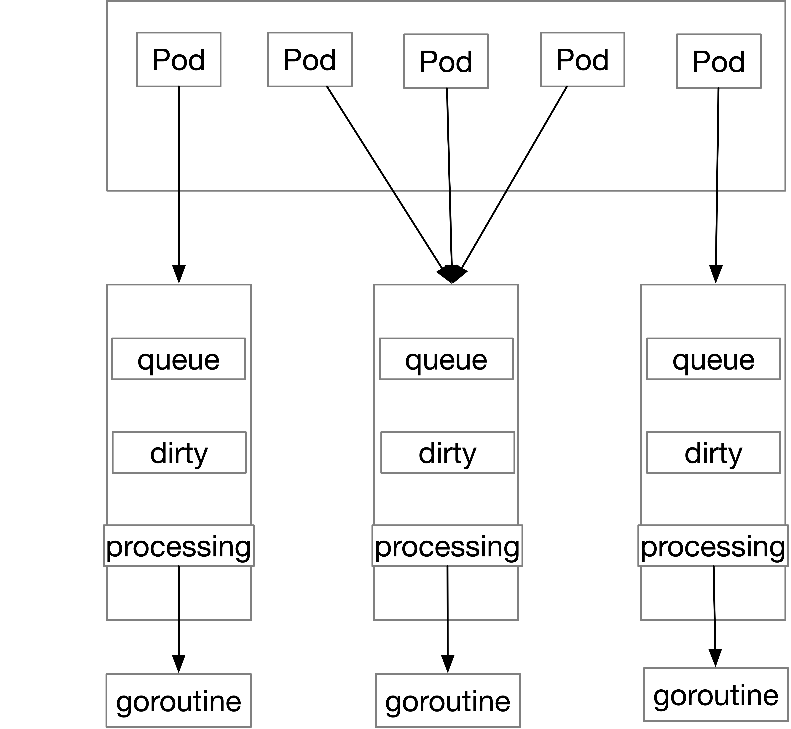

Sure, here is a sample `README.md` content describing the design of the `ShardedQueue`:


# ShardedQueue Design

## Overview

The `ShardedQueue` is a specialized queue implementation designed to handle high concurrency and efficient task distribution across multiple shards. It is particularly useful in scenarios where tasks need to be processed in parallel by multiple goroutines, ensuring that tasks are evenly distributed and managed.



## Key Components

### CacheKey

```go
type CacheKey[T reconcile.Request] func(T reconcile.Request, shardCount int) int
```

The `CacheKey` is a function type that takes a `reconcile.Request` and a shard count, and returns an integer hash value. This hash value is used to determine the shard to which a task should be assigned.

### TypedShardedQueueConfig

```go
type TypedShardedQueueConfig[T reconcile.Request] struct {
    Name              string
    shards            []workqueue.TypedRateLimitingInterface[reconcile.Request]
    HashFn            CacheKey[reconcile.Request]
    CurrentShard      int
    GoroutineSharding map[int64]int
    shardCount        int
    mu                sync.RWMutex
}
```

The `TypedShardedQueueConfig` struct holds the configuration for the sharded queue. It includes:
- `Name`: The name of the queue.
- `shards`: An array of rate-limiting queues.
- `HashFn`: The function to get the hash value of a key.
- `CurrentShard`: The current goroutine ID assigned to a shard.
- `GoroutineSharding`: A map of goroutine IDs to shard indices.
- `shardCount`: The number of shards.
- `mu`: A read-write lock for synchronizing access to the sharding map.

### NewShardedQueue

```go
func NewShardedQueue(controllerName string, rateLimiter workqueue.TypedRateLimiter[reconcile.Request], shardCount int, fn CacheKey[reconcile.Request]) workqueue.TypedRateLimitingInterface[reconcile.Request]
```

The `NewShardedQueue` function creates a new sharded queue with the given parameters. It initializes the shards and returns a `TypedShardedQueueConfig` instance.

### Methods

- `Len() int`: Returns the total length of the queue or the length of the shard assigned to the current goroutine.
- `ShutDownWithDrain()`: Shuts down the queue with drain, either for the shard assigned to the current goroutine or for all shards.
- `ShuttingDown() bool`: Checks if the queue is shutting down, either for the shard assigned to the current goroutine or for all shards.
- `AddAfter(item T, duration time.Duration)`: Adds an item to the queue after a specified duration, using the hash function to determine the shard.
- `AddRateLimited(item T)`: Adds an item to the queue with rate limiting, using the hash function to determine the shard.
- `Forget(item T)`: Forgets an item in the queue, using the hash function to determine the shard.
- `NumRequeues(item T) int`: Returns the number of requeues for an item, using the hash function to determine the shard.
- `Add(item T)`: Adds an item to the queue, using the hash function to determine the shard.
- `Get() (T, bool)`: Retrieves an item from the queue, assigning the current goroutine to a shard if not already assigned.
- `Done(item T)`: Marks an item as done in the queue, using the hash function to determine the shard.
- `ShutDown()`: Shuts down the queue for all shards.

### GetGoroutineID

```go
func GetGoroutineID() int64
```

The `GetGoroutineID` function returns the ID of the current goroutine. It parses the stack information to extract the goroutine ID.

## Usage

To use the `ShardedQueue`, you need to create a new instance using the `NewShardedQueue` function and configure it with the appropriate parameters. You can then use the provided methods to manage tasks within the queue.

## Example

```go
func main() {
    klog.InitFlags(flag.CommandLine)
    flag.Parse()
    log.SetLogger(zap.New(zap.UseDevMode(true)))

    aggregatedScheme := k8sruntime.NewScheme()
    utilruntime.Must(scheme.AddToScheme(aggregatedScheme))
    config := controllerruntime.GetConfigOrDie()
    controllerOptions := controllerruntime.Options{
        Scheme:         aggregatedScheme,
        LeaderElection: false,
    }
    controllerManager, err := controllerruntime.NewManager(config, controllerOptions)
    if err != nil {
        klog.ErrorS(err, "Failed to build controller manager")
        panic(err)
    }
    c := NewController(controllerManager.GetClient())
    if err = c.SetupWithManager(controllerManager); err != nil {
        panic(err)
    }
    if err = controllerManager.Start(context.Background()); err != nil {
        klog.ErrorS(err, "Starting controller manager exits unexpectedly")
        panic(err)
    }
}
```

This example demonstrates how to initialize and start a controller manager with a custom controller that uses the `ShardedQueue`.

## Conclusion

The `ShardedQueue` provides an efficient way to manage tasks across multiple shards, ensuring high concurrency and effective task distribution. By leveraging the `CacheKey` function and the `TypedShardedQueueConfig` struct, you can easily integrate sharded queues into your applications.
