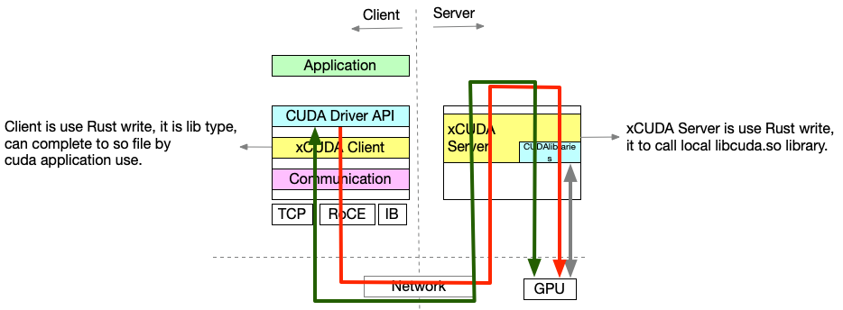

# xCUDA

`xCUDA` 是一个类似于 `rCUDA` 的自研项目，通过对 `CUDA` 的拦截来实现 `GPU` 的远程调用，是一个 `Client-Server` 的架构；它主要由两个代码模块组成：
- 一个是 `xCUDA-client`，它被编译为 `so` 文件，供上层 `CUDA` 应用程序动态链接使用。
- 一个是 `xCUDA-server`, 它是接受 `client` 的请求并调用本地的 `libcuda.so` 文件执行真正的请求，然后响应结果给客户端。

